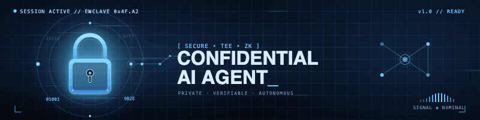
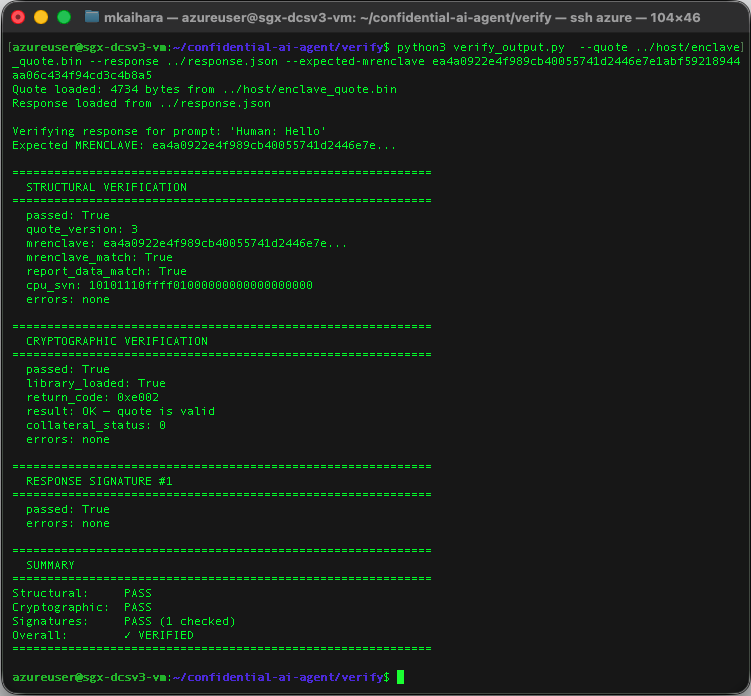
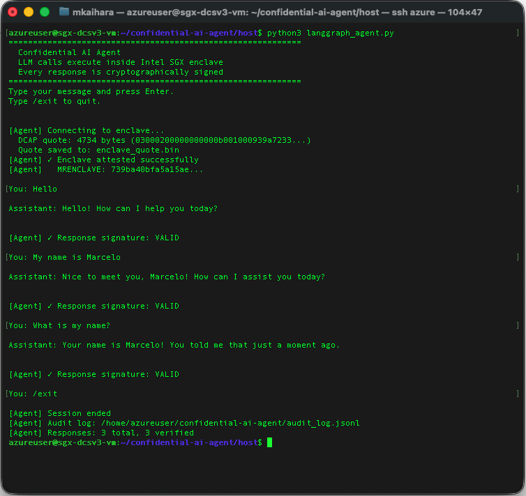

<p align="center">  </p>

<p align="center"> <a href="LICENSE">  </a> </p>

# Confidential AI Agent

A LangGraph-based AI agent where the Claude API key and signing key live inside an Intel SGX enclave. The LLM call executes from inside the enclave. The host process never holds secrets. Every response is cryptographically signed and independently verifiable.

Built with Python, LangGraph, Gramine, and the Anthropic Claude API. Deployed on Azure DCsv3 (SGX-capable hardware).

---

## What this project demonstrates

- A running LLM agent whose API credentials are sealed inside SGX hardware using the hardware-derived `_sgx_mrenclave` key
- Cryptographic output signing: every response carries an ECDSA-P256 signature over `SHA256(prompt ‖ result ‖ timestamp ‖ MRENCLAVE)`
- DCAP remote attestation: a DCAP quote binds the signing key to the enclave measurement, verified against Intel's certificate authority
- An independent verification CLI that validates the complete trust chain without requiring access to the running system

The combination is new. Gramine running the Anthropic Python SDK with sealed storage, output signing, and DCAP attestation wired together in a LangGraph agent has no prior published implementation.

---

## Related work

ETH Zurich researchers recently published the first comprehensive benchmark of confidential LLM inference across Intel SGX, TDX, and NVIDIA H100 Confidential Compute GPUs (arXiv:2509.18886, September 2025). They show that CPU TEEs impose under 10% throughput and 20% latency overhead on full Llama2 inference pipelines (7B, 13B, 70B parameters), using Gramine as the LibOS layer — the same stack used here. Their conclusion: TEEs are currently the only viable method for protecting LLM inference.

That paper studies **confidential inference** — running model weights and the full inference pipeline inside the TEE to protect proprietary models and user prompts. This project studies a complementary problem: **verifiable agent execution** — running an agent that calls an external LLM API from inside the TEE, protecting the API credential and proving output integrity to a third party. The ETH Zurich results validate the underlying technology stack and performance assumptions this project relies on.

---

## Architecture

```
┌─────────────────────────────────────────────────────────────┐
│  HOST (outside SGX)                                         │
│                                                             │
│  LangGraph agent (host/langgraph_agent.py)                  │
│   - manages conversation state                              │
│   - routes prompts to enclave via TCP socket                │
│   - verifies every response signature before display        │
│   - verifies DCAP attestation quote at startup              │
│   - writes append-only audit log                            │
│   - never holds API key or signing private key              │
└────────────────────────┬────────────────────────────────────┘
                         │ TCP socket (localhost:7777)
                         │ JSON messages, length-prefix framing
┌────────────────────────▼────────────────────────────────────┐
│  SGX ENCLAVE (enclave/enclave_llm.py via Gramine LibOS)     │
│                                                             │
│  On startup:                                                │
│   - loads API key from /sealed/anthropic_api_key            │
│   - loads ECDSA signing key from /sealed/signing_key        │
│   - generates DCAP quote binding signing key to MRENCLAVE   │
│                                                             │
│  On each prompt:                                            │
│   - calls api.anthropic.com over HTTPS (TLS inside SGX)     │
│   - signs SHA256(prompt ‖ result ‖ timestamp ‖ MRENCLAVE)   │
│   - returns result + signature + public key + DCAP quote    │
└─────────────────────────────────────────────────────────────┘
                         │
                         │ /sealed mount (type = "encrypted", key_name = "_sgx_mrenclave")
┌────────────────────────▼────────────────────────────────────┐
│  SEALED STORAGE (disk, encrypted)                           │
│                                                             │
│  /sealed/anthropic_api_key  — Anthropic API key             │
│  /sealed/signing_key        — ECDSA P-256 private key       │
│                                                             │
│  Decryption key = KDF(MRENCLAVE, CPU hardware fuse secret)  │
│  Unreadable outside this exact enclave on this exact CPU    │
└─────────────────────────────────────────────────────────────┘
```
[Detailed Architecture](https://www.marcelokaihara.com/architecture.html)

---

## What SGX protects

**Memory encryption.** The enclave runs inside EPC (Enclave Page Cache). The CPU's Memory Encryption Engine encrypts EPC using a key only the CPU knows. The host OS, hypervisor, and Azure infrastructure cannot read enclave memory.

**Sealed storage.** Files on the `/sealed` mount are encrypted with a key derived from the enclave's MRENCLAVE measurement and a hardware secret fused into the CPU at manufacture. Only this exact enclave (same code, same configuration) on this exact physical CPU can decrypt them. Change a single line of enclave code and the MRENCLAVE changes — the sealed files become permanently unreadable and must be re-provisioned.

**Remote attestation.** The DCAP quote is a cryptographic certificate signed by Intel's PKI. It contains the enclave's MRENCLAVE and a `report_data` field we populate with `SHA256(signing_public_key)`. A verifier anywhere can check this quote against Intel's certificate authority and confirm: this response was signed by a key that was present inside a real SGX enclave with measurement X.

**Output integrity.** Every LLM response is signed with ECDSA-P256 over `SHA256(prompt ‖ result ‖ timestamp ‖ MRENCLAVE)`. The signature covers the input, the output, and the enclave identity. A tampered response cannot produce a valid signature.

---

## Threat model

### What this system defends against

| Attack | Defense | Relies on |
|---|---|---|
| Read API key from host memory | Key exists only in EPC, encrypted by CPU Memory Encryption Engine | Hardware (CPU MEE) |
| Read API key from disk | Encrypted with key derived from MRENCLAVE + CPU hardware fuse secret | Hardware + Measurement |
| Modify enclave code to exfiltrate key | MRENCLAVE changes, sealed files become unreadable, quote verification fails | Measurement |
| Run same enclave code on a different CPU | Sealed files unreadable — hardware fuse secret differs, decryption fails. MRENCLAVE check passes but the enclave cannot bootstrap | Hardware |
| Substitute different enclave code | MRENCLAVE changes — verifier detects mismatch, sealed files unreadable | Measurement |
| Forge a response signature | Private key never exits enclave memory; sealed with hardware-derived key | Hardware + Measurement |
| Replay an old response | Timestamp is bound into the signed payload | Measurement + Audit |
| Claim a different enclave produced the response | DCAP quote binds signing key hash to MRENCLAVE via Intel CA. Combined with code audit confirming the key is generated inside the enclave, this proves the key originated inside the specific measured enclave on genuine SGX hardware | Hardware + Measurement + Audit |

### What this system does not defend against

**Compromised CPU or Intel.** SGX's root of trust is Intel. If Intel's PKI is compromised or the CPU is backdoored, the guarantees do not hold.

**DNS hijacking.** DNS resolution happens on the host OS. A compromised host could redirect `api.anthropic.com`. The TLS certificate is verified inside the enclave using the `certifi` CA bundle, which is measured in MRENCLAVE — a redirected server would need a valid certificate for `api.anthropic.com` to pass TLS verification.

**Prompt injection via LLM response.** The enclave signs whatever the LLM returns. A prompt injection attack could cause the LLM to include sensitive content in its response, which the enclave would faithfully sign. Policy enforcement on response content is not implemented.

**Bootstrap exposure.** On first startup, `ANTHROPIC_API_KEY` is passed as an environment variable, visible to the host OS. This happens once. The enclave immediately seals it to hardware-encrypted storage. In production this step would use a remote attestation provisioning flow — the enclave proves its identity via DCAP before receiving the key.

**Side-channel attacks.** SGX does not protect against all microarchitectural side channels (Spectre, Foreshadow, SGAxe). Intel microcode mitigations reduce but do not eliminate this surface.

**Gramine TCB.** Running Python inside Gramine includes the LibOS, syscall shim, and Python runtime in the trusted computing base. This is larger than a native C SGX enclave. The tradeoff is development velocity and compatibility with existing Python libraries.

---

## How to verify a response

The verification CLI does not require a running enclave or SGX hardware. It runs on any machine with the Intel DCAP libraries and Azure QPL installed.

```bash
python3 verify/verify_output.py \
  --quote host/enclave_quote.bin \
  --response sample_response.json \
  --expected-mrenclave $(cat expected_mrenclave.txt)
```

The response JSON must contain:

```json
{
  "prompt": "...",
  "result": "...",
  "timestamp": 1234567890.0,
  "mrenclave": "...",
  "signature_hex": "...",
  "public_key_pem": "-----BEGIN PUBLIC KEY-----\n...",
  "payload_hash": "..."
}
```

The verifier runs three independent checks:

**Structural** (pure Python, works offline). Parses the DCAP quote binary, extracts MRENCLAVE and `report_data`, confirms MRENCLAVE matches the expected value, and confirms `report_data[:32] == SHA256(public_key_der)`. Proves the quote was built for this specific signing key inside the expected enclave.

**Cryptographic** (requires Azure THIM access). Calls `tee_verify_quote` from Intel's `libsgx_dcap_quoteverify` library. Fetches PCK certificate, TCB info, QE identity, and CRL from Azure THIM. Confirms the quote signature chain is valid up to Intel's root CA. Proves the quote came from genuine SGX hardware.

**Response signature**. Rebuilds `SHA256(prompt ‖ result ‖ timestamp ‖ mrenclave)` and verifies the ECDSA-P256 signature. Proves the response has not been modified since it left the enclave.

A response passes verification only if all three checks succeed.

### Sample verification



---

## Prerequisites

- Azure DCsv3 VM (`Standard_DC2s_v3` or larger) — SGX2 + FLC required
- Ubuntu 24.04 (Noble)
- Gramine 1.9
- Intel SGX PSW + AESMD
- Azure DCAP client (built from source — `az-dcap-client` is not packaged for Ubuntu 24.04)
- Python 3.12
- `uv` (Python package manager)

---

## Setup

### 1. Install Gramine and SGX PSW

```bash
# Add Gramine repo
sudo curl -fsSLo /etc/apt/keyrings/gramine-keyring-$(lsb_release -sc).gpg \
  https://packages.gramineproject.io/gramine-keyring-$(lsb_release -sc).gpg
echo "deb [arch=amd64 signed-by=/etc/apt/keyrings/gramine-keyring-$(lsb_release -sc).gpg] \
  https://packages.gramineproject.io/ $(lsb_release -sc) main" \
  | sudo tee /etc/apt/sources.list.d/gramine.list

# Add Intel SGX repo
sudo curl -fsSLo /etc/apt/keyrings/intel-sgx-deb.asc \
  https://download.01.org/intel-sgx/sgx_repo/ubuntu/intel-sgx-deb.key
echo "deb [arch=amd64 signed-by=/etc/apt/keyrings/intel-sgx-deb.asc] \
  https://download.01.org/intel-sgx/sgx_repo/ubuntu $(lsb_release -sc) main" \
  | sudo tee /etc/apt/sources.list.d/intel-sgx.list

sudo apt-get update
sudo apt-get install -y gramine libsgx-enclave-common libsgx-urts \
  libsgx-aesm-launch-plugin libsgx-aesm-pce-plugin libsgx-aesm-ecdsa-plugin \
  libsgx-aesm-quote-ex-plugin libsgx-pce-logic libsgx-qe3-logic \
  libsgx-dcap-ql libsgx-dcap-default-qpl libsgx-quote-ex sgx-aesm-service

sudo systemctl enable aesmd && sudo systemctl start aesmd
```

### 2. Configure Azure THIM endpoint

```bash
sudo tee /etc/sgx_default_qcnl.conf << 'EOF'
{
  "pccs_url": "https://global.acccache.azure.net/sgx/certification/v4/",
  "use_secure_cert": true,
  "collateral_service": "https://global.acccache.azure.net/sgx/certification/v4/",
  "pccs_api_version": "3.1",
  "retry_times": 6,
  "retry_delay": 5,
  "local_pck_url": "http://169.254.169.254/metadata/THIM/sgx/certification/v4/",
  "pck_cache_expire_hours": 168,
  "verify_collateral_cache_expire_hours": 168,
  "local_cache_only": false
}
EOF
sudo systemctl restart aesmd
```

### 3. Build and install Azure DCAP client

The `az-dcap-client` package is not available for Ubuntu 24.04. Build from source:

```bash
sudo apt-get install -y cmake build-essential libssl-dev libcurl4-openssl-dev \
  pkg-config libgtest-dev nlohmann-json3-dev

git clone https://github.com/microsoft/Azure-DCAP-Client.git
cd Azure-DCAP-Client/src/Linux
./configure && make

# Replace Intel's QPL with Microsoft's
sudo mv /usr/lib/x86_64-linux-gnu/libdcap_quoteprov.so.1.*.0 \
  /tmp/libdcap_quoteprov.so.intel.bak
sudo cp libdcap_quoteprov.so \
  /usr/lib/x86_64-linux-gnu/libdcap_quoteprov.so.1.microsoft
sudo rm -f /usr/lib/x86_64-linux-gnu/libdcap_quoteprov.so.1
sudo ln -s libdcap_quoteprov.so.1.microsoft \
  /usr/lib/x86_64-linux-gnu/libdcap_quoteprov.so.1
sudo ldconfig
```

### 4. Generate the enclave signing key

```bash
gramine-sgx-gen-private-key
```

### 5. Install Python dependencies

Install `uv` (fast Python package manager used to manage the enclave's isolated environment):

```bash
curl -LsSf https://astral.sh/uv/install.sh | sh
source $HOME/.local/bin/env

# Verify
uv --version
```

Add `uv` to your PATH permanently so it survives VM restarts:

```bash
echo 'source $HOME/.local/bin/env' >> ~/.bashrc
```
The enclave uses `uv` to manage an isolated `.venv` whose packages are
declared in `sgx.trusted_files` and measured in MRENCLAVE. The host uses
system pip because it runs outside the SGX trust boundary.

# Enclave dependencies — isolated venv used inside SGX
```bash
cd enclave
uv venv --python 3.12 .venv
uv pip install --python .venv/bin/python \
  anthropic httpx certifi cryptography
```

# Host dependencies — installed to system Python
```bash
pip3 install langgraph langchain-core cryptography --break-system-packages
```

### 6. Build the enclave

```bash
cd enclave
make clean && make
```

The build prints the MRENCLAVE measurement:

```
Measurement:
    1be5c23f7e86c0d0ef891aa9b3109c91782576b7e37b8dd1e803d992b4edc5e3
```

Record this value:

```bash
echo "1be5c23f7e86c0d0ef891aa9b3109c91782576b7e37b8dd1e803d992b4edc5e3" \
  > expected_mrenclave.txt
```

### 7. Create the sealed directory

```bash
mkdir -p sealed
```

---

## Running the agent

### First run — bootstrap sealed storage

On first run, provide the Anthropic API key. The enclave seals it immediately using the hardware-derived `_sgx_mrenclave` key and never requires it again.

**Terminal 1 — start the enclave:**

```bash
cd enclave
ANTHROPIC_API_KEY=sk-ant-... gramine-sgx enclave_llm
```

Wait for:

```
[ENCLAVE] No sealed API key found — checking environment
[ENCLAVE] API key sealed to /sealed/anthropic_api_key (future runs need no env var)
[ENCLAVE] No sealed signing key found — generating new key pair
[ENCLAVE] Signing key sealed to /sealed/signing_key
[ENCLAVE] DCAP quote generated (4734 bytes)
[ENCLAVE] Ready — waiting for connections on port 7777
```

**Terminal 2 — run the agent:**

```bash
python3 host/langgraph_agent.py
```

### All subsequent runs — no secrets needed

```bash
# Terminal 1
cd enclave
gramine-sgx enclave_llm

# Terminal 2
python3 host/langgraph_agent.py
```

The enclave loads both the API key and the signing key from sealed storage with no external input. The signing key fingerprint and public key are identical across restarts, giving the enclave a persistent cryptographic identity.

### Sample session



---

## After changing enclave code

When you modify `enclave_llm.py` or the manifest, MRENCLAVE changes and the sealed files become unreadable. This is correct behavior — a new code version should establish a new identity and re-provision its secrets.

```bash
# Delete stale sealed files
rm sealed/*

# Rebuild
cd enclave && make clean && make

# Re-bootstrap with API key
ANTHROPIC_API_KEY=sk-ant-... gramine-sgx enclave_llm

# Update the expected MRENCLAVE (printed as "Measurement:" during make)
echo "<new-mrenclave>" > expected_mrenclave.txt
```

---

## Project structure

```
confidential-ai/
├── enclave/
│   ├── enclave_llm.py                 # enclave process — runs inside SGX
│   ├── enclave_llm.manifest.template  # Gramine manifest — defines trust boundary
│   ├── Makefile
│   └── .venv/                         # Python packages for the enclave
├── host/
│   ├── langgraph_agent.py             # LangGraph conversational agent
│   └── host_agent.py                  # low-level test harness
├── verify/
│   ├── quote_verifier.py              # verification engine (importable)
│   └── _output.py               # standalone verification CLI
├── sealed/                            # hardware-encrypted secrets (gitignored)
├── expected_mrenclave.txt             # canonical enclave measurement
├── audit_log.jsonl                    # append-only session audit log
└── README.md
```

---

## Known limitations and future work

**Bootstrap exposure.** The first run passes `ANTHROPIC_API_KEY` as an environment variable, visible to the host OS. After that single run the key is hardware-sealed and never appears in the clear again. In production, this bootstrap step should use a remote attestation provisioning flow: the enclave generates a DCAP quote, a trusted provisioning server verifies it, and sends the key encrypted to the enclave's public key over an attested TLS channel.

**Post-quantum signing.** Output signing uses ECDSA-P256, which is vulnerable to Shor's algorithm on a sufficiently powerful quantum computer. A production deployment should use a hybrid scheme combining ECDSA-P256 with ML-DSA (NIST FIPS 204). The signing primitive in `enclave_llm.py` and the verification primitive in `/quote_verifier.py` are the only components that would need to change.

**Policy enforcement.** The enclave signs whatever the LLM returns. A future version could add a policy engine inside the enclave that validates outputs before signing — for example, refusing to sign responses that contain known sensitive data patterns.

**Conversation history in the clear.** The full conversation history is sent to the enclave with each prompt. A host operator can read all conversation history. Encrypting it would require a key exchange protocol between host and enclave.

**Tamper-evident audit log.** The current audit log is append-only but not cryptographically chained. A production version should hash-chain entries so any modification to a past entry invalidates all subsequent ones.

**AMD SEV-SNP.** SGX was chosen for process-level isolation and mature DCAP attestation tooling via Gramine. AMD SEV-SNP provides VM-level confidential computing with a different trust boundary. The architectural principles here — sealed secrets, signed outputs, remote attestation — apply equally to SEV-SNP.

**`az-dcap-client` packaging.** Microsoft's `az-dcap-client` package is not available for Ubuntu 24.04 as of the time of writing. The setup instructions include building from source. This will simplify once Microsoft publishes a Noble package.

---

## Security notes

- Never commit `sealed/` contents or any plaintext secrets to version control. Add `sealed/` to `.gitignore`.
- The `audit_log.jsonl` contains prompt text. Treat as sensitive if prompts contain confidential data.
- Rotate the API key by deleting `sealed/anthropic_api_key`, restarting the enclave with the new `ANTHROPIC_API_KEY`, and letting it re-seal.
- The enclave signing key at `~/.config/gramine/enclave-key.pem` signs the MRENCLAVE measurement and establishes MRSIGNER. Protect it. In production, use an HSM or Azure Key Vault.

---

## Hardware and infrastructure

- **VM:** Azure Standard_DC2s_v3 (2 vCPU, 16 GB RAM, 8 GB EPC)
- **CPU:** Intel Xeon 8370C (Ice Lake), SGX1 + SGX2, FLC
- **Attestation:** DCAP via Azure THIM (`global.acccache.azure.net`)
- **Gramine:** 1.9
- **Python:** 3.12.3
- **Anthropic SDK:** 0.97.0

---

## References

- [Gramine documentation](https://gramine.readthedocs.io/)
- [Intel SGX DCAP Quote Library API](https://download.01.org/intel-sgx/latest/dcap-latest/linux/docs/)
- [Azure Trusted Hardware Identity Management](https://learn.microsoft.com/en-us/azure/security/fundamentals/trusted-hardware-identity-management)
- [Microsoft Azure DCAP Client](https://github.com/microsoft/Azure-DCAP-Client)
- [NIST ML-DSA (FIPS 204)](https://csrc.nist.gov/pubs/fips/204/final)
- [Anthropic API documentation](https://docs.anthropic.com)
- [LangGraph documentation](https://langchain-ai.github.io/langgraph/)
- [Confidential LLM Inference: Performance and Cost Across CPU and GPU TEEs](https://arxiv.org/abs/2509.18886) — ETH Zurich, arXiv:2509.18886, September 2025
